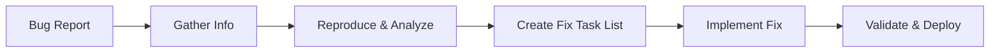

# Bug Fix Workflow

Systematically identify, reproduce, fix, and verify bug corrections following best practices.

## Bug Fix Pipeline



## Phase 1: Information Gathering

### Check for Issue Tracking

First, ask the user:
> "Do you have a Linear ticket or GitHub issue for this bug? If you have Linear configured via MCP, I can fetch the details directly."

**Check MCP availability:**
```typescript
// Check if Linear MCP is configured
const linearAvailable = await checkMcpServer('linear');
if (linearAvailable) {
  // Can fetch Linear tickets directly
  const bugTicket = await fetchLinearIssue(issueId);
}
```

**If Linear/GitHub issue exists:**
- If Linear MCP available: Fetch issue details via MCP directly
- If GitHub CLI available: Use `gh issue view [ISSUE-NUMBER]`
- Extract description, reproduction steps, and context
- Note any linked PRs or related issues
- Get severity/priority from ticket

**If no issue tracking or MCP not available:**
- Gather information manually
- Ask for bug description and reproduction steps
- Suggest configuring Linear MCP for better integration

### Initial Bug Assessment

1. **Gather Information**
   - Bug description and expected behavior
   - Actual behavior and error messages
   - Stack traces or error logs
   - Severity and user impact
   - Environment where bug occurs

2. **Document Bug Details**
   Create a bug analysis document:
   ```markdown
   ## Bug: [Title]
   
   ### Reproduction Steps
   1. [Step 1]
   2. [Step 2]
   3. [Step 3]
   
   ### Expected Behavior
   [What should happen]
   
   ### Actual Behavior
   [What actually happens]
   
   ### Error Messages/Logs
   ```
   [Error details]
   ```
   
   ### Environment
   - Browser/Node version:
   - OS:
   - Related packages:
   ```

## Phase 2: Reproduction & Analysis

1. **Set Up Test Environment**
   - Create minimal reproduction case
   - Isolate the problem area
   - Verify consistent reproduction
   - Document exact steps

2. **Locate the Problem**
   ```bash
   # Check tool availability
   if ! command -v grep &> /dev/null; then
     echo "⚠️ grep not available"
     exit 1
   fi
   
   if ! command -v git &> /dev/null; then
     echo "⚠️ git not installed"
     exit 1
   fi
   
   # Search for error message
   grep -r "error text" --include="*.ts" 2>/dev/null || echo "No matches found"
   
   # Find related components
   grep -r "ComponentName" --include="*.tsx" 2>/dev/null || echo "No matches found"
   
   # Check recent changes (if in git repo)
   if git rev-parse --git-dir > /dev/null 2>&1; then
     git log -p --since="1 week ago" path/to/file
   else
     echo "⚠️ Not in a git repository"
   fi
   ```

3. **Root Cause Analysis**
   - Identify the exact line/function causing issue
   - Understand why the bug occurs
   - Check when it was introduced (git blame)
   - Determine why tests didn't catch it
   - Search for similar patterns that might have same bug

## Phase 3: Create Fix Task List

### Generate Bug Fix Tasks

Create a structured task list for the fix:

```markdown
### Bug Fix Tasks: [Bug Title]

#### Relevant Files
- `path/to/buggy/file.ts` - File containing the bug
- `path/to/buggy/file.test.ts` - Test file to add regression test
- `path/to/related/file.ts` - Related file that may need updates

#### Tasks

- [ ] 1.0 Reproduce and Test Setup
  - [ ] 1.1 Create failing test that reproduces the bug
  - [ ] 1.2 Verify test fails consistently
  - [ ] 1.3 Add edge case tests around the bug

- [ ] 2.0 Implement Fix
  - [ ] 2.1 Apply minimal fix to resolve root cause
  - [ ] 2.2 Verify reproduction test now passes
  - [ ] 2.3 Ensure all existing tests still pass

- [ ] 3.0 Validation
  - [ ] 3.1 Test fix in original bug scenario
  - [ ] 3.2 Check for regressions in related features
  - [ ] 3.3 Performance impact assessment

- [ ] 4.0 Cleanup and Documentation
  - [ ] 4.1 Remove any debug code
  - [ ] 4.2 Update documentation if needed
  - [ ] 4.3 Add comment only if fix is non-obvious
```

## Phase 4: Implementation

### Execute Bug Fix Tasks

1. **Use Task List Protocol**
   - Work through tasks one sub-task at a time
   - Wait for user approval between sub-tasks
   - Commit after completing parent tasks
   - Use TodoWrite tool to track progress

2. **TDD Approach for Bug Fixes**
   ```typescript
   describe('Bug: [description]', () => {
     test('should [correct behavior] when [bug scenario]', () => {
       // This test should FAIL before the fix
       // Arrange: Set up exact bug conditions
       const bugScenario = setupBugConditions();
       
       // Act: Trigger the problematic code
       const result = problematicFunction(bugScenario);
       
       // Assert: Verify correct behavior
       expect(result).toBe(expectedValue);
     });
   });
   ```

3. **Implementation Guidelines**
   - Make minimal necessary changes
   - Follow existing patterns (don't refactor unless needed)
   - Add defensive checks where appropriate
   - Handle edge cases discovered during analysis
   - Keep fix focused on the bug (resist scope creep)

## Phase 5: Validation

### Quality Assurance

1. **Run All Quality Gates**
   ```bash
   # Check if Node.js project
   if [ -f "package.json" ] && command -v npm &> /dev/null; then
     npm test 2>/dev/null || echo "⚠️ Tests not configured or failing"
     npm run typecheck 2>/dev/null || echo "⚠️ TypeScript checking not configured"
     npm run lint 2>/dev/null || echo "⚠️ Linting not configured"
   else
     echo "ℹ️ Not a Node.js project - use appropriate testing commands for your stack"
   fi
   ```

2. **Regression Testing**
   - Verify original bug is fixed
   - Test related functionality
   - Check edge cases
   - No performance degradation
   - No new bugs introduced

3. **Manual Verification**
   - Test in original bug environment
   - Verify in different browsers/platforms if applicable
   - Confirm with bug reporter if possible

## Phase 6: Documentation & Completion

### Finalize the Fix

1. **Update Issue Tracking**
   If using Linear/GitHub:
   - Update ticket status
   - Add implementation notes
   - Link to PR/commit

2. **Commit Message Format**
   ```bash
   # Ensure git is available
   if ! command -v git &> /dev/null; then
     echo "⚠️ Git not installed"
     exit 1
   fi
   
   git commit -m "fix: [what was broken]" \
     -m "Root cause: [why it happened]" \
     -m "Solution: [how it was fixed]" \
     -m "Testing: [how verified]" \
     -m "Fixes #[issue-id]"
   ```

3. **Create PR if needed**
   - Reference the bug ticket
   - Include before/after behavior
   - List testing performed
   - Note any risks or concerns

## Bug Fix Checklist

Before marking as complete:

- [ ] Bug is consistently reproducible before fix
- [ ] Root cause is identified and documented
- [ ] Fix addresses the root cause (not just symptoms)
- [ ] Test is written that fails without fix
- [ ] Test passes with fix applied
- [ ] All existing tests still pass
- [ ] No regression in related functionality
- [ ] Code passes quality gates (lint, typecheck)
- [ ] Fix is tested in relevant environments
- [ ] Performance impact is acceptable
- [ ] No debug code or console.logs remain
- [ ] Commit message follows convention (GH-1)

## Common Bug Categories & Approaches

### 1. Null/Undefined Errors
- Add null checks
- Use optional chaining (?.)
- Provide default values
- Validate inputs

### 2. Race Conditions
- Add proper await/async
- Use locks or semaphores
- Implement proper sequencing
- Add loading states

### 3. State Management Issues
- Verify state updates are immutable
- Check for stale closures
- Ensure proper cleanup
- Use proper dependencies

### 4. Off-by-One Errors
- Review loop boundaries
- Check array indices
- Verify range calculations
- Add boundary tests

### 5. Type Mismatches
- Add proper type guards
- Use branded types (C-TS3)
- Validate at boundaries
- Fix type definitions

## Quick Commands

```bash
# Tool availability check
check_tool() {
  if ! command -v "$1" &> /dev/null; then
    echo "⚠️ $1 not installed. $2"
    return 1
  fi
  return 0
}

# Git commands (with checks)
if check_tool "git" "Git is required"; then
  # Find recent changes to file
  git log -p path/to/file
  
  # Find when line was introduced
  git blame path/to/file
  
  # Check what changed recently
  git diff HEAD~5..HEAD path/to/file
fi

# Search for error message
if check_tool "grep" "grep is required"; then
  grep -r "error message" --include="*.ts" 2>/dev/null || echo "No matches found"
fi

# Run specific test file (Node.js projects)
if [ -f "package.json" ] && check_tool "npm" "Install Node.js"; then
  npm test path/to/test.spec.ts 2>/dev/null || echo "⚠️ Test failed or not found"
fi
```

## Post-Fix Analysis

### Lessons Learned

After completing the fix, document:

1. **Prevention Analysis**
   - Could better tests have caught this?
   - Could better types have prevented this?
   - Should we add lint rules?
   - Are there similar bugs elsewhere?

2. **Process Improvements**
   - Was the bug report complete?
   - Did we find it quickly?
   - Could tooling help next time?

3. **Share Knowledge**
   - Update team documentation
   - Share fix pattern if reusable
   - Consider adding to coding guidelines

## Summary

The bug fix workflow ensures:
- Systematic approach to debugging
- Proper test coverage for regressions
- Minimal, focused fixes
- Clear documentation and tracking
- Knowledge sharing for prevention

Remember: A good bug fix not only solves the immediate problem but also prevents similar issues in the future.