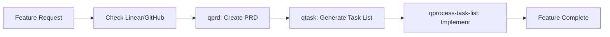

# New Feature Implementation

Implement a new feature following the PRD → Task List → Systematic Implementation workflow.

## Feature Development Pipeline



## Phase 0: Check for Issue Tracking

### First, check for existing tickets

Ask the user:
> "Do you have a Linear ticket or GitHub issue for this feature? If you have Linear configured via MCP, I can fetch the requirements directly."

**Check for Linear MCP availability:**
```typescript
// Check if Linear MCP is configured
const linearAvailable = await checkMcpServer('linear');
if (linearAvailable) {
  // Can fetch Linear tickets directly
  const ticket = await fetchLinearTicket(ticketId);
}
```

**If Linear/GitHub issue exists:**
- If Linear MCP available: Fetch issue details via MCP
- If GitHub CLI available: Use `gh issue view`
- Extract feature description and requirements
- Note acceptance criteria and user stories
- Check for linked design docs or mockups
- Use this information to inform PRD creation

**If no issue tracking or MCP not available:**
- Proceed with manual requirements gathering
- Create PRD from user input
- Suggest setting up Linear MCP for future use

## Phase 1: Requirements Documentation (qprd)

### Create or enhance PRD based on ticket info:

1. **Gather Requirements**
   - If ticket exists, incorporate ticket details
   - Ask clarifying questions to fill gaps
   - Understand goals, users, and scope
   - Document acceptance criteria

2. **Generate PRD**
   - Use `qprd` command to create structured PRD
   - Include ticket reference if applicable
   - Save as `prd-[feature-name].md` in `/tasks/`
   - Ensure all sections are complete

## Phase 2: Task Planning (qtask)

With PRD ready, generate implementation tasks:

1. **Analyze PRD**
   - Review functional requirements
   - Understand user stories
   - Note technical considerations

2. **Generate Task List**
   - Use `qtask` command with the PRD
   - Creates `tasks-prd-[feature-name].md`
   - Breaks down into parent tasks and sub-tasks
   - Identifies files to create/modify

## Phase 3: Systematic Implementation (qprocess-task-list)

Execute the task list methodically:

1. **Follow Task Protocol**
   - Use `qprocess-task-list` with the task list
   - Implement one sub-task at a time
   - Wait for user approval between sub-tasks
   - Commit completed parent tasks

2. **Implementation Guidelines**
   - **TDD Approach**: Write failing test → implement → pass (C-1)
   - **Domain Language**: Use business terms in naming (C-2)
   - **Clean Code**: Self-documenting, no unnecessary comments (C-3)
   - **Simple Functions**: Don't over-extract (C-4)
   - **Type Safety**: Use branded types for IDs (C-TS3)
   - **Pure Functions**: Prefer composable, testable functions (C-TS2)

## Phase 4: Quality Assurance

### During Implementation

Apply quality checks at each step:

1. **Function/Method Checklist**
   - Easy to follow without mental gymnastics?
   - Avoids deep nesting/high complexity?
   - Uses appropriate data structures?
   - All parameters used?
   - Testable in isolation?
   - Named appropriately?

2. **Test Quality**
   - Edge cases and boundaries covered
   - Invalid inputs tested
   - Realistic scenarios included
   - Holistic assertions used (T-TS3)
   - Tests grouped under describe blocks (T-TS5)

3. **Code Standards**
   - Passes `prettier --check` (G-TS1)
   - Passes `turbo typecheck lint` (G-TS2)
   - No console.logs or debug code
   - Follows existing patterns

### Final Validation

Before marking feature complete:

1. **Run Quality Gates**
   ```bash
   npm test                    # All tests pass
   npm run typecheck          # No type errors
   npm run lint               # Code standards met
   ```

2. **Update Documentation**
   - System architecture updated if needed (D-1, D-2)
   - README includes feature info (D-3)
   - Docs in sync with implementation (D-4)

3. **Verify Completion**
   - ✅ All PRD requirements implemented
   - ✅ All tasks in task list marked complete
   - ✅ Test coverage comprehensive
   - ✅ No regression in existing functionality
   - ✅ Performance acceptable
   - ✅ Error handling robust
   - ✅ Code ready for peer review

4. **Update Issue Tracking**
   If using Linear/GitHub:
   - Update ticket status to "In Review" or "Done"
   - Add implementation notes
   - Link to PR and relevant commits
   - Note any deviations from original requirements

## Workflow Commands

```bash
# Prerequisites check
check_tool() {
  if ! command -v "$1" &> /dev/null; then
    echo "⚠️ $1 not installed. $2"
    return 1
  fi
  return 0
}

# Step 0: Check for Linear/GitHub ticket
# If using GitHub CLI:
if check_tool "gh" "Install from https://cli.github.com (optional)"; then
  # Fetch issue details if available
  gh issue view [ISSUE-NUMBER] 2>/dev/null || echo "ℹ️ No GitHub issue found"
fi

# Step 1: Create PRD
# Use qprd command to generate PRD
# Include ticket reference if applicable
# Output: /tasks/prd-[feature-name].md

# Step 2: Generate task list
# Use qtask command with PRD
# Output: /tasks/tasks-prd-[feature-name].md

# Step 3: Implement systematically
# Use qprocess-task-list with task list
# Implements one sub-task at a time

# During implementation (Node.js projects)
if [ -f "package.json" ] && check_tool "npm" "Install Node.js"; then
  npm test [test-file]       # Run specific tests
  npm run typecheck 2>/dev/null || echo "⚠️ typecheck not configured"
  npm run lint 2>/dev/null || echo "⚠️ lint not configured"
fi

# Branch management
if check_tool "git" "Git is required"; then
  git checkout -b feat/[feature-name]
  git add .
  git commit -m "feat: [description]" \
    -m "Implements: [ticket-id]" \
    -m "[additional details]"
fi

# Update Linear/GitHub (if using gh CLI)
if command -v gh &> /dev/null; then
  # Mark issue as in-progress/done
  gh issue edit [ISSUE-NUMBER] --add-label "in-progress"
  # Link PR to issue
  gh pr create --title "feat: [description]" --body "Closes #[ISSUE-NUMBER]"
fi
```

## Common Pitfalls to Avoid

- ❌ Skipping PRD creation for complex features
- ❌ Not following the task list systematically
- ❌ Implementing multiple sub-tasks without commits
- ❌ Forgetting to wait for user approval between tasks
- ❌ Creating new patterns when existing ones work
- ❌ Over-engineering simple features
- ❌ Leaving debug code or console.logs
- ❌ Not updating task list as you work

## Success Metrics

A feature is successfully implemented when:
1. PRD requirements fully satisfied
2. Task list completely checked off
3. All tests passing
4. Code meets quality standards
5. Documentation updated
6. No performance degradation
7. Ready for production deployment