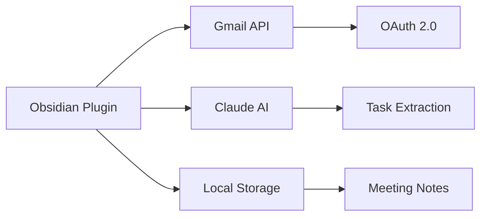

# Obsidian Meeting Tasks Plugin

> Automatically extract actionable tasks from Gmail meeting transcripts using Claude AI and create organized meeting notes in Obsidian.


## 🌟 Features

- **📧 Direct Gmail Integration** - OAuth 2.0 authentication without external services
- **🤖 AI Task Extraction** - Claude AI intelligently extracts tasks, decisions, and action items
- **📊 Visual Task Dashboard** - Interactive dashboard with priority-based organization
- **🏗️ Standalone Architecture** - Everything runs within Obsidian, no daemon required
- **📁 Smart Organization** - Automatic year/month folder structure for meeting notes
- **🔄 Real-time Processing** - Process emails on-demand with keyboard shortcuts
- **🔗 Gmail Links** - Direct links to view emails in Gmail
- **📎 Attachment Tracking** - View attachment names and sizes in notes
- **♻️ Email Reprocessing** - One-click reprocessing with latest extraction logic
- **👥 Smart Assignees** - Automatically assigns tasks to meeting participants
- **📋 Next Steps** - Captures Google Meet AI suggestions and action items

## 📚 Documentation

- [Google OAuth Setup Guide](./docs/google-oauth-setup.md) - **Start here!** Step-by-step Google Cloud setup
- [System Architecture](./docs/system-architecture.md) - Technical architecture and diagrams
- [Build & Deployment Guide](./docs/BUILD_DEPLOYMENT.md) - Development and deployment instructions
- [CLAUDE.md](./CLAUDE.md) - AI assistant instructions for contributors

## 🚀 Quick Start

### Installation

#### Option 1: Interactive Deployment (Recommended)
```bash
npm install
npm run deploy
```
The interactive script will find your Obsidian vaults and install the plugin automatically.

#### Option 2: Manual Installation
1. Download `main.js`, `manifest.json`, and `styles.css`
2. Create folder: `<vault>/.obsidian/plugins/meeting-tasks/`
3. Copy the files to that folder
4. Enable plugin in Obsidian settings

### Configuration

1. **Google OAuth Setup**
   - Follow the [Google OAuth Setup Guide](./docs/google-oauth-setup.md) for detailed instructions
   - Quick summary: Create project → Enable Gmail API → Configure OAuth → Get credentials
   - Copy Client ID and Secret to plugin settings

2. **Claude AI Setup** (Optional)
   - Get API key from [Anthropic](https://console.anthropic.com/)
   - Add to plugin settings
   - Choose model (Haiku, Sonnet, or Opus)

3. **Plugin Settings**
   - Set lookback time (e.g., "3d" for 3 days)
   - Configure Gmail labels (default: "transcript")
   - Set notes folder location

## 💡 Usage

### Process Emails
- **Command Palette**: `Cmd/Ctrl + P` → "📧 Process meeting emails"
- **Keyboard Shortcut**: `Cmd/Ctrl + Shift + M`
- **Ribbon Icon**: Click the mail icon
- **Reprocess**: Click "🔄 Reprocess this email" link at bottom of any meeting note

### Task Dashboard
- View all tasks from meeting notes
- Filter by priority, date, or assignee
- Toggle "My Tasks" view
- Click to complete tasks
- Edit task details inline

## 🏗️ Architecture Overview



The plugin operates as a standalone solution within Obsidian, directly communicating with Gmail and Claude APIs. See [System Architecture](./docs/system-architecture.md) for detailed diagrams.

## 🔧 Development

### Prerequisites
- Node.js 16+
- npm 7+
- Obsidian for testing

### Setup
```bash
# Install dependencies
npm install

# Development build
npm run dev

# Production build
npm run build

# Type checking
npm run lint

# Deploy to vault
npm run deploy
```

### Project Structure
```
├── src/               # TypeScript source files
│   ├── main.ts       # Plugin entry point
│   ├── gmailService.ts    # Gmail API integration
│   ├── claudeExtractor.ts # AI task extraction
│   ├── taskDashboard.ts   # Dashboard UI
│   └── oauthServer.ts     # OAuth handler
├── docs/             # Documentation
├── dist/            # Build output
└── deploy.sh        # Deployment script
```

## 📋 Task Format

Meeting notes include tasks in this format:
```markdown
### 🔴 High Priority
- [ ] Task description [[@Assignee]] 📅 2024-12-29 ⚠️ 85% #category
  - Context: Additional information
  > "Quote from meeting"

## Next Steps
### 🟡 Medium Priority
- [ ] Follow-up action [[@Owner]]
```

## ✨ What's New in v2.0

- **Enhanced Task Extraction**: Better recognition of Google Meet AI suggestions
- **Smart Next Steps**: Automatically assigns owners based on participants
- **Email Reprocessing**: Update existing notes with improved extraction
- **Attachment Support**: Shows attachment metadata in meeting notes
- **Gmail Integration**: Direct links to view emails in Gmail
- **Deduplication**: Prevents duplicate tasks and next steps

## 🔒 Security & Privacy

- **Local Storage**: OAuth tokens and settings stored locally
- **No External Servers**: Direct API communication only
- **Data Privacy**: No data persistence outside your vault
- **Secure Authentication**: OAuth 2.0 with refresh tokens

## 🐛 Troubleshooting

### Common Issues

**Gmail Authentication Failed**
- Verify OAuth credentials in settings
- Ensure Gmail API is enabled
- Try re-authenticating

**Only Getting 50 Emails**
- Check if you have more emails with the specified label
- Gmail returns all matching emails (pagination works for >50)
- Try different labels or time ranges
- Use "Reset processed emails" to reprocess existing ones

**Tasks Not Extracting**
- Check Anthropic API key
- Verify API usage limits
- Notes will be created without AI extraction

**Dashboard Not Loading**
- Ensure meeting notes exist
- Check task format in notes
- Reload Obsidian (Cmd/Ctrl + R)

**Changes Not Taking Effect**
- Reload Obsidian with Cmd/Ctrl + R
- Disable and re-enable the plugin
- Check console (Ctrl+Shift+I) for errors

## 🤝 Contributing

Contributions are welcome! Please read [CLAUDE.md](./CLAUDE.md) for AI-assisted development guidelines.

## 📄 License

MIT License - see [LICENSE](./LICENSE) file for details.

## 🙏 Acknowledgments

- Obsidian team for the plugin API
- Google for Gmail API
- Anthropic for Claude AI
- Community contributors

---

<div align="center">
Made with ❤️ for the Obsidian community
</div>