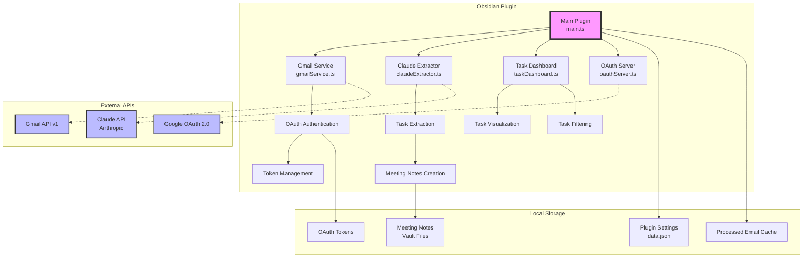
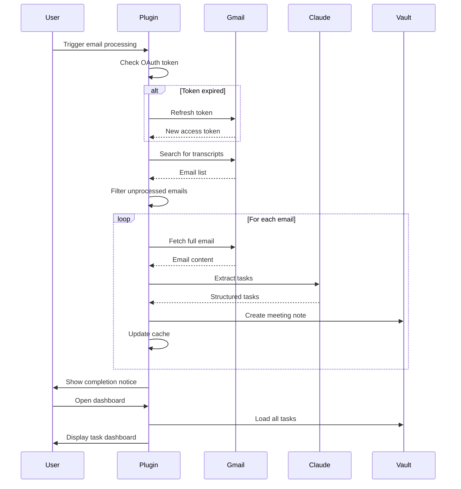
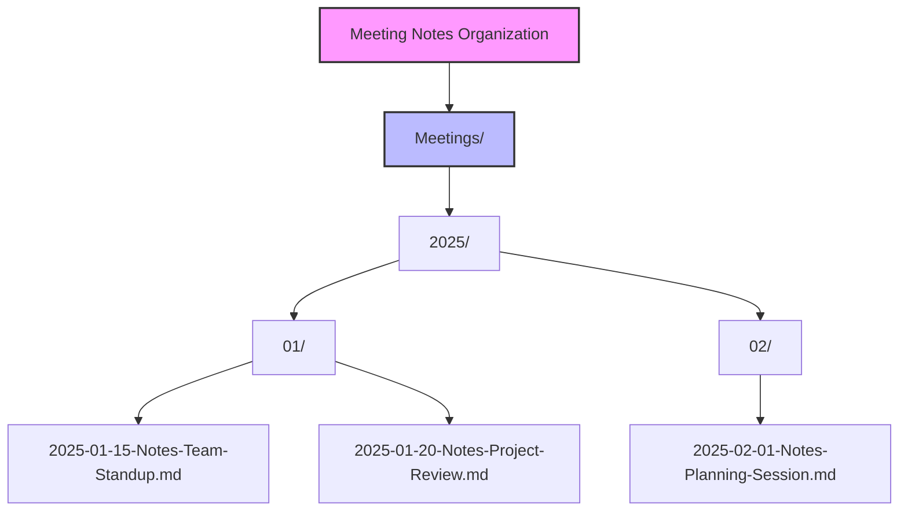
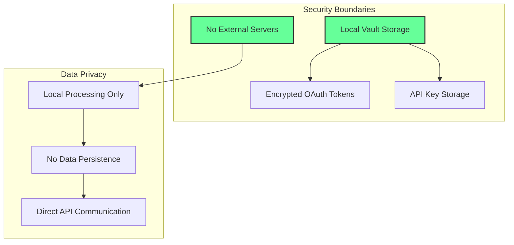
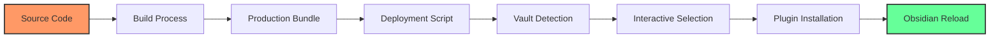

# System Architecture - Obsidian Meeting Tasks Plugin

## Overview

The Obsidian Meeting Tasks Plugin is a standalone solution that integrates directly with Gmail API and Claude AI to automatically extract and manage tasks from meeting transcripts. The plugin operates entirely within Obsidian without requiring external services or daemons.

## Architecture Diagram



## Component Architecture

### Core Components

#### 1. Main Plugin (main.ts)
- **Purpose**: Entry point and orchestrator
- **Responsibilities**:
  - Plugin lifecycle management
  - Command registration
  - Settings management
  - Event handling
  - Service initialization

#### 2. Gmail Service (gmailService.ts)
- **Purpose**: Direct Gmail API integration
- **Features**:
  - OAuth 2.0 authentication flow
  - Token refresh management
  - Email search and retrieval
  - Attachment metadata extraction
  - Gmail URL generation for direct email access
  - Batch processing support
  - Rate limiting protection

#### 3. Claude Extractor (claudeExtractor.ts)
- **Purpose**: AI-powered task extraction
- **Capabilities**:
  - Meeting transcript analysis
  - Task identification and prioritization
  - Assignee detection from participants
  - Next steps extraction with owner assignment
  - Google Meet AI suggestions capture
  - Task/Next step deduplication
  - Confidence scoring
  - Fallback extraction mode

#### 4. Task Dashboard (taskDashboard.ts)
- **Purpose**: Visual task management interface
- **Features**:
  - Priority-based task organization
  - Interactive task completion
  - Advanced filtering options
  - Real-time statistics
  - My Tasks/All Tasks toggle
  - Next steps visualization with assignees

#### 5. OAuth Server (oauthServer.ts)
- **Purpose**: Local OAuth callback handler
- **Functions**:
  - Temporary HTTP server for OAuth flow
  - Authorization code capture
  - Token exchange handling

## Data Flow



## Authentication Flow


## File Organization



## Task Format Structure

```typescript
interface TaskStructure {
  content: string;           // Task description
  assignee?: string;         // [[@Person]]
  priority: 'high' | 'medium' | 'low';
  dueDate?: string;         // YYYY-MM-DD format
  confidence?: number;       // 0-100 percentage
  category?: string;        // #tag format
  context?: string;         // Additional information
  originalQuote?: string;   // From transcript
}
```

## Performance Characteristics

- **Email Processing**: Up to 100 emails per run
- **Parallel Batching**: 3-5 emails processed simultaneously
- **Transcript Limit**: 15,000 characters per email
- **Cache Strategy**: Frontmatter-based deduplication
- **Memory Usage**: ~50MB typical footprint
- **Build Size**: ~65KB minified bundle

## Security Model



## Deployment Architecture



## Recent Enhancements (v2.0)

### Enhanced Email Processing
- **Gmail Links**: Direct links to view emails in Gmail web interface
- **Attachment Handling**: Full attachment metadata with file sizes
- **Email Reprocessing**: One-click reprocessing with latest extraction logic

### Improved Task Extraction
- **Next Steps Recognition**: Captures Google Meet AI suggestions
- **Smart Assignee Matching**: Assigns tasks based on meeting participants
- **Deduplication Logic**: Prevents duplicate tasks and next steps
- **Priority-based Organization**: Tasks and next steps grouped by priority

### Meeting Note Features
- **Reprocess Link**: Every note includes a reprocess action
- **Protocol Handlers**: Custom `obsidian://` URLs for actions
- **Live Note Updates**: Replace existing notes when reprocessing

## Error Handling Strategy

1. **OAuth Errors**: Token refresh with exponential backoff
2. **API Rate Limits**: Built-in rate limiting and retry logic
3. **Network Failures**: Graceful degradation with user notifications
4. **Parsing Errors**: Fallback extraction mode
5. **Cache Conflicts**: Automatic resolution with deduplication
6. **Reprocessing Safety**: Preserves file paths and handles conflicts

## Future Architecture Considerations

- **WebSocket Support**: For real-time email monitoring
- **Plugin API**: For third-party integrations
- **Sync Service**: For multi-device task synchronization
- **Template Engine**: For customizable note formats
- **Analytics Dashboard**: For productivity insights