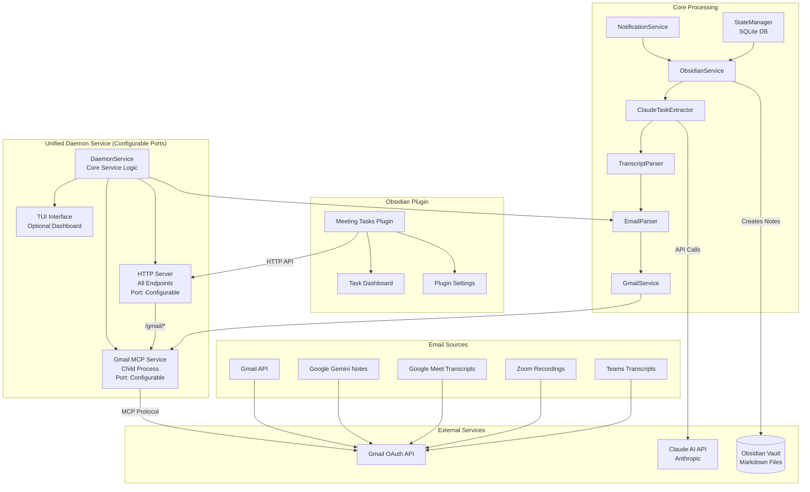
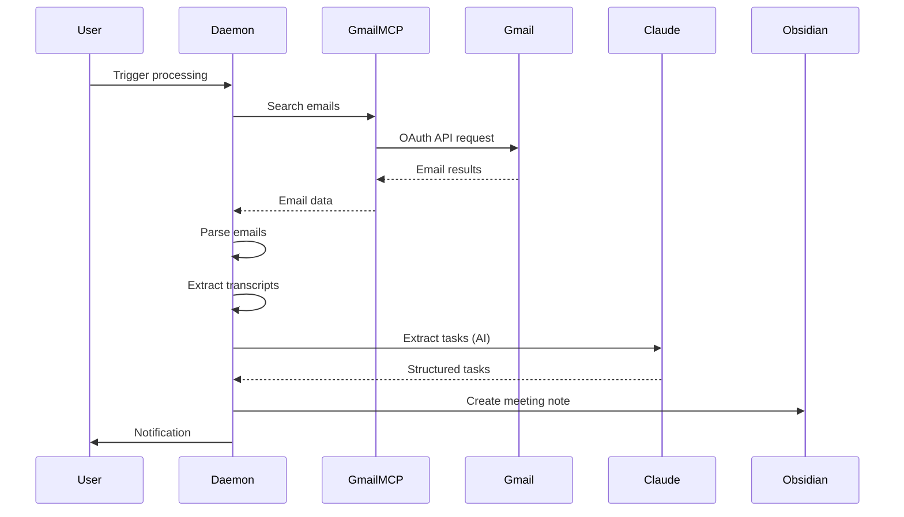
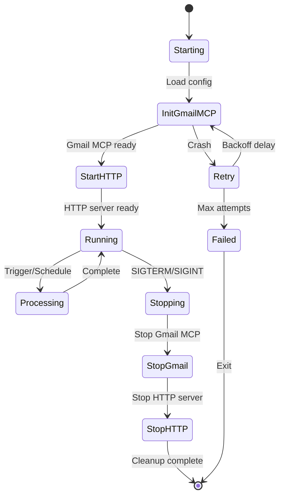

# System Architecture

## Overview

The Meeting Transcript Agent is an automated system that monitors Gmail for meeting transcripts, extracts actionable tasks using AI, and creates organized notes in your Obsidian vault. The system runs as a unified daemon service with integrated Gmail MCP, providing both scheduled processing and manual triggers through an HTTP API, with optional Terminal User Interface (TUI) for real-time monitoring.

## Unified Daemon Architecture



## Component Details

### 1. Unified Daemon Service
**Location**: `src/daemon.ts`, `src/daemon/`
- **Single Service Architecture**: One process manages everything
- **Integrated Gmail MCP**: Child process lifecycle management
- **Configurable Ports**: 
  - HTTP Server: Default 3002 (configurable via CLI/env)
  - Gmail MCP: Default 3000 (configurable via CLI/env)
- **Port Configuration Methods**:
  ```bash
  # CLI Arguments (highest priority)
  npm run daemon -- --http-port 8080 --gmail-mcp-port 9000
  
  # Environment Variables (medium priority)
  HTTP_SERVER_PORT=8080 GMAIL_MCP_PORT=9000 npm run daemon
  
  # Default Values (lowest priority)
  npm run daemon  # Uses 3002 for HTTP, 3000 for Gmail MCP
  ```
- **Endpoints**:
  - `/health` - Service health check
  - `/status` - Detailed statistics
  - `/trigger` - Manual email processing
  - `/gmail/health` - Gmail MCP health
  - `/gmail/search` - Search emails
  - `/gmail/read` - Read email by ID
- **TUI Mode**: Optional terminal dashboard
- **Headless Mode**: For server deployments

### 2. Gmail MCP Integration
**Location**: `src/daemon/gmailMcpService.ts`
- **Child Process Management**: Spawns and monitors Gmail MCP
- **Automatic Restart**: Exponential backoff on crashes
- **Request/Response Queue**: Handles MCP protocol communication
- **Error Recovery**: Authentication guidance and retry logic
- **Configuration**:
  ```typescript
  {
    restartAttempts: 3,
    startupTimeout: 10000,
    requestTimeout: 30000
  }
  ```

### 3. Email Processing Pipeline
**Components**:
1. **GmailService** (`src/services/gmailService.ts`)
   - Connects to daemon's Gmail MCP endpoint
   - Searches and retrieves emails
   
2. **EmailParser** (`src/parsers/emailParser.ts`)
   - Identifies meeting transcripts
   - Pattern matching for various formats
   
3. **TranscriptParser** (`src/parsers/transcriptParser.ts`)
   - Extracts text from attachments
   - Supports: PDF, DOCX, TXT, HTML, VTT, SRT
   
4. **ClaudeTaskExtractor** (`src/extractors/claudeTaskExtractor.ts`)
   - AI-powered task extraction
   - Structured JSON output
   - Fallback pattern matching

5. **ObsidianService** (`src/services/obsidianService.ts`)
   - Creates formatted meeting notes
   - Links to daily notes
   - Maintains folder structure

### 4. State Management
**Location**: `src/database/stateManager.ts`
- **SQLite Database**: `data/state.db`
- **Processed Emails Tracking**: Prevents duplicates
- **Task Deduplication**: Similarity checking
- **Statistics**: Processing history and metrics

### 5. Obsidian Plugin Integration
**Location**: `obsidian-plugin/`
- **Connection**: Uses daemon's HTTP API
- **Endpoints**: `http://localhost:<HTTP_PORT>/gmail/*` (default: 3002)
- **Features**:
  - Visual task dashboard
  - Manual processing triggers
  - Settings management
  - Real-time status updates
  - Configurable server URL for custom ports

## Data Flow

### Email Processing Flow


### Daemon Lifecycle


## Deployment Options

### 1. Development Mode
```bash
npm run dev         # With auto-reload
npm run daemon      # With TUI dashboard
```

### 2. Production Mode
```bash
npm run daemon:headless  # No UI, quiet mode
```

### 3. Systemd Service (Linux)
```bash
# Install service with dynamic vault configuration
sudo npm run daemon:install
# Script will prompt for Obsidian vault path or read from .env

# Start the service
sudo systemctl start meeting-transcript-agent@$USER

# Enable auto-start on boot
sudo systemctl enable meeting-transcript-agent@$USER

# Uninstall the service
sudo npm run daemon:uninstall
```

### 4. Docker Container
```dockerfile
FROM node:20
WORKDIR /app
COPY . .
RUN npm install && npm run build
CMD ["npm", "run", "daemon:headless"]
```

## Port Configuration System

### Configuration Priority
The daemon uses a three-tier priority system for port configuration:

1. **CLI Arguments** (Highest Priority)
   - `--http-port <port>` - Set HTTP server port
   - `--gmail-mcp-port <port>` - Set Gmail MCP service port
   - Supports both `--port=value` and `--port value` syntax

2. **Environment Variables** (Medium Priority)
   - `HTTP_SERVER_PORT` - HTTP server port
   - `GMAIL_MCP_PORT` - Gmail MCP service port

3. **Default Values** (Lowest Priority)
   - HTTP Server: 3002
   - Gmail MCP: 3000

### Port Validation
- **Range**: Ports must be between 1024-65535
- **Conflicts**: HTTP and Gmail MCP must use different ports
- **Availability**: Automatic detection and alternative suggestions
- **Error Recovery**: Comprehensive suggestions for all port errors

### Configuration Examples
```bash
# View current configuration
npm run daemon -- --config-dump

# Development with custom ports
npm run daemon -- --http-port 4000 --gmail-mcp-port 4001

# Production with environment variables
HTTP_SERVER_PORT=8080 GMAIL_MCP_PORT=8081 npm run daemon:headless

# Docker with port mapping
docker run -p 8080:3002 -p 9000:3000 meeting-agent

# Multiple instances
npm run daemon -- --http-port 5000 --gmail-mcp-port 5001  # Instance 1
npm run daemon -- --http-port 6000 --gmail-mcp-port 6001  # Instance 2
```

## Configuration

### Environment Variables
```env
# Required
OBSIDIAN_VAULT_PATH=/path/to/vault

# Port Configuration (optional)
HTTP_SERVER_PORT=3002        # HTTP API server port
GMAIL_MCP_PORT=3000          # Gmail MCP service port

# Recommended
ANTHROPIC_API_KEY=sk-ant-api03-xxx

# Gmail MCP (Auto-configured)
GMAIL_MCP_RESTART_ATTEMPTS=3
GMAIL_MCP_STARTUP_TIMEOUT=10000
GMAIL_MCP_REQUEST_TIMEOUT=30000

# Optional
GMAIL_HOURS_LOOKBACK=120
NOTIFICATION_CHANNELS=console,desktop
TZ=America/New_York
```

### Gmail OAuth Setup
1. Create Google Cloud project
2. Enable Gmail API
3. Create OAuth 2.0 credentials (Desktop type)
4. Save as `~/.gmail-mcp/gcp-oauth.keys.json`
5. Run initial authentication:
   ```bash
   npx @gongrzhe/server-gmail-autoauth-mcp
   ```

## Performance Characteristics

### Resource Usage
- **Memory**: ~150-250MB typical
- **CPU**: <5% idle, 10-20% processing
- **Disk**: SQLite DB grows ~1MB/1000 emails
- **Network**: Minimal (Gmail API + Claude API)

### Processing Limits
- **Email Search**: 250 units/sec (Gmail API)
- **Task Extraction**: 2-5 sec/transcript
- **Batch Size**: 50 emails/run default
- **Transcript Size**: 15,000 chars max

### Scalability
- **Emails**: Tested with 10,000+ emails
- **Tasks**: 100,000+ tasks in database
- **Concurrent Requests**: Single-threaded by design
- **Multi-user**: Requires separate instances

## Systemd Service Installation

### Dynamic Configuration
The installation script (`scripts/install-service.sh`) provides intelligent service configuration:

1. **User Detection**: Uses `$SUDO_USER` to properly identify the actual user (not root)
2. **Vault Path Discovery**: 
   - First checks `.env` file for `OBSIDIAN_VAULT_PATH`
   - Prompts interactively if not found
   - Validates the path exists
3. **Service File Generation**: Creates a custom systemd service file with:
   - Specific `ReadWritePaths` for the user's vault
   - Proper security restrictions (`ProtectSystem`, `ProtectHome`)
   - User-specific working directory
4. **Build Process**: Runs `npm run build` as the correct user, not root

### Service Management Commands
```bash
# Install (prompts for vault path)
sudo npm run daemon:install

# Start/stop/restart
sudo systemctl start meeting-transcript-agent@$USER
sudo systemctl stop meeting-transcript-agent@$USER
sudo systemctl restart meeting-transcript-agent@$USER

# View logs
sudo journalctl -u meeting-transcript-agent@$USER -f

# Check status
sudo systemctl status meeting-transcript-agent@$USER

# Enable/disable auto-start
sudo systemctl enable meeting-transcript-agent@$USER
sudo systemctl disable meeting-transcript-agent@$USER

# Uninstall completely
sudo npm run daemon:uninstall
```

## Security Considerations

### Authentication & Tokens
- **Gmail OAuth**: Stored in `~/.gmail-mcp/`
- **API Keys**: Environment variables only
- **Refresh Tokens**: Auto-renewed by Gmail MCP

### Data Privacy
- **Local Processing**: No cloud storage
- **Transcript Handling**: Memory only, not persisted
- **Task Storage**: Local SQLite database
- **Network**: Localhost only for services

### Access Control
- **HTTP API**: Localhost binding only
- **File Permissions**: User-level access
- **Obsidian Vault**: Standard file system permissions

## Monitoring & Debugging

### Health Checks
```bash
# Overall health
curl http://localhost:3002/health

# Gmail MCP status
curl http://localhost:3002/gmail/health

# Detailed statistics
curl http://localhost:3002/status
```

### Log Files
- **Application**: `logs/app.log`
- **Daemon**: `daemon.log` (if redirected)
- **Debug Mode**: Set `LOG_LEVEL=debug`

### Common Issues
1. **Gmail Auth Failed**: Re-run OAuth flow
2. **Port in Use**: Check for orphaned processes
3. **High Memory**: Restart daemon periodically
4. **Slow Processing**: Check Claude API limits

## Migration from Old Architecture

### Before (Multiple Services)
- Gmail MCP HTTP wrapper on port 3001
- Separate daemon on port 3002
- Manual service management

### After (Unified Daemon)
- Single service on port 3002
- Integrated Gmail MCP management
- Automatic lifecycle handling
- Simplified deployment

### Migration Steps
1. Stop old services
2. Update Obsidian plugin settings
3. Start unified daemon

## Recent Enhancements

### Systemd Service Improvements (2025-09-01)
- **Dynamic Vault Configuration**: Install script now prompts for vault path
- **User Detection**: Proper handling of sudo user (uses $SUDO_USER not root)
- **Security**: Service file generated with specific vault write permissions
- **Build Process**: Runs npm build as correct user, not root
- **Installation**: Service automatically configured for user's Obsidian vault

### API Key Integration (2025-08-30)
- **Feature**: Plugin now passes Anthropic API key to daemon
- **Configuration**: API key stored in plugin settings
- **Processing**: Daemon receives key via `/trigger` endpoint
- **Result**: Full Claude AI task extraction enabled

### Obsidian Plugin Updates (2025-08-29)

#### Filter Button Count Badges
- **Feature**: Real-time count badges on all filter buttons
- **Performance**: 150ms debounced updates
- **Behavior**: Zero counts hide badges automatically
- **Visual**: Color-coded badges match filter types

#### Dashboard UI Simplification
- **Removed**: Redundant stats cards at top
- **Integrated**: Metrics directly in filter buttons
- **Result**: Cleaner interface with better information density

### Obsidian Plugin Updates (2025-08-27)

#### Multi-Name Task Filtering
- **Feature**: Support comma-separated names in "My Tasks" filter
- **Configuration**: `dashboardMyName: "name1, name2, the group"`
- **Behavior**: Shows tasks assigned to any of the specified names
- **Use Case**: Team members and group assignments

#### Smooth Task Completion
- **Animation**: 0.3s fade-out and slide effect
- **Scroll Preservation**: No page jump when completing tasks
- **Smart Cleanup**: Empty cards and sections auto-remove
- **Statistics**: Real-time updates without full refresh

#### Security Improvements
- **data.json**: Now gitignored for API key protection
- **Template**: data.json.example provided for setup
- **Defaults**: Removed hardcoded personal information

## Future Enhancements

### Planned Features
- [ ] WebSocket support for real-time updates
- [ ] Multiple Gmail account support
- [ ] Plugin system for additional MCPs
- [ ] Distributed processing
- [ ] Web-based dashboard
- [ ] Mobile app integration

### Architecture Improvements
- [ ] Message queue for reliability
- [ ] Caching layer for performance
- [ ] Metrics collection (Prometheus)
- [ ] Container orchestration (K8s)

## Related Documentation

- [README.md](../README.md) - Getting started guide
- [CLAUDE.md](../CLAUDE.md) - AI assistant context
- [Daemon Service Guide](daemon-service.md) - TUI and service details
- [API Reference](api-reference.md) - Complete endpoint documentation
- [Gmail Setup Guide](GMAIL_SETUP.md) - OAuth configuration
- [Unified Daemon Architecture](ARCHITECTURE_UNIFIED_DAEMON.md) - Integration details