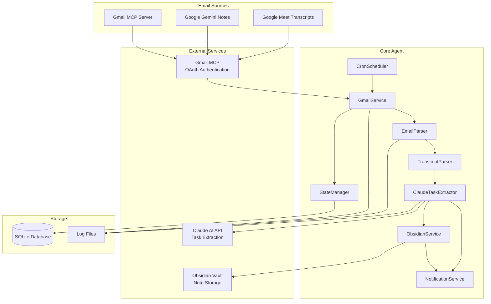
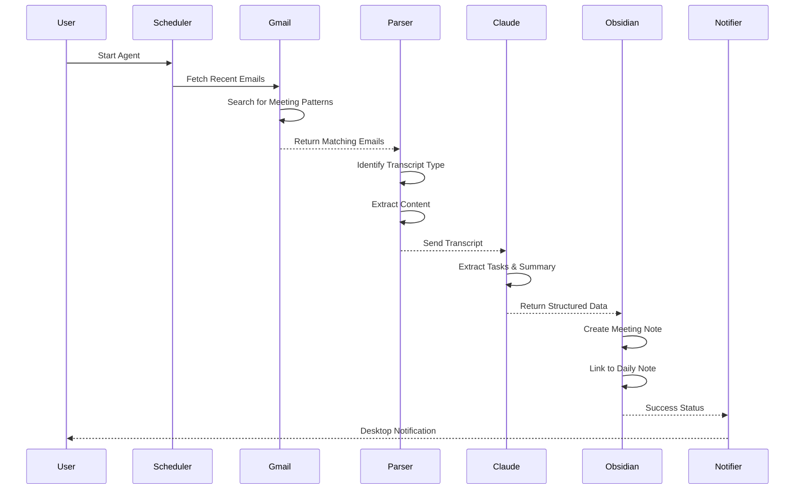
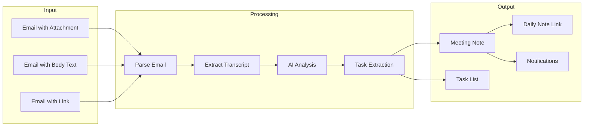
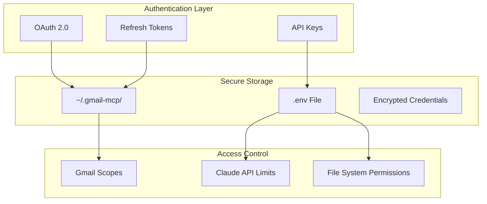
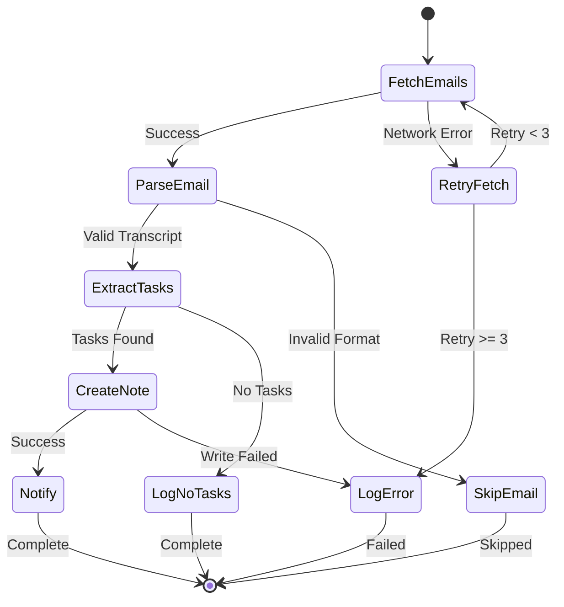

# System Architecture

## Overview

The Meeting Transcript Agent is an automated system that monitors Gmail for meeting transcripts, extracts actionable tasks using AI, and creates organized notes in your Obsidian vault.

## Architecture Diagram



## Component Flow



## Data Flow



## Component Details

### Gmail Service
- **Purpose**: Interface with Gmail via MCP protocol
- **Authentication**: OAuth 2.0 via Gmail MCP server
- **Operations**:
  - Search emails by patterns
  - Read email content
  - Download attachments
  - Mark emails as processed

### Email Parser
- **Purpose**: Identify meeting transcript emails
- **Patterns Detected**:
  - Google Meet recordings
  - Zoom recordings
  - Teams transcripts
  - Gemini meeting notes
- **Confidence Scoring**: 0-100% based on pattern matches

### Transcript Parser
- **Purpose**: Extract structured content from various formats
- **Supported Formats**:
  - PDF documents
  - Text files
  - VTT subtitles
  - HTML content
  - Plain text body

### Claude Task Extractor
- **Purpose**: AI-powered task and insight extraction
- **Extracts**:
  - Action items with assignees
  - Key decisions
  - Meeting summary
  - Participants
  - Next steps
  - Priority levels

### Obsidian Service
- **Purpose**: Create and organize meeting notes
- **Features**:
  - Hierarchical folder structure (Year/Month)
  - Frontmatter metadata
  - Task formatting with checkboxes
  - Daily note linking
  - Participant linking

### State Manager
- **Purpose**: Track processed emails and prevent duplicates
- **Storage**: SQLite database
- **Tracks**:
  - Processed email IDs
  - Task history
  - Processing errors
  - Performance metrics

### Notification Service
- **Purpose**: Multi-channel notifications
- **Channels**:
  - Console output
  - Desktop notifications (native)
  - Obsidian in-app
  - Slack webhooks
- **Priority Levels**: High, Normal, Low

### Cron Scheduler
- **Purpose**: Automated periodic processing
- **Default Schedule**: 9 AM, 1 PM, 5 PM
- **Modes**:
  - Continuous (scheduled)
  - Once (single run)
  - Test (validation only)

## Security Architecture



## Error Handling



## Performance Considerations

### Rate Limiting
- Gmail API: 250 quota units per user per second
- Claude API: Based on tier (default: 50 requests/minute)
- Batch processing: Up to 50 emails per run

### Caching Strategy
- Email metadata cached for 30 days
- Processed email IDs stored indefinitely
- Transcript content not cached (privacy)

### Resource Usage
- Memory: ~100-200MB typical
- CPU: Burst usage during AI processing
- Disk: Minimal (logs + SQLite database)
- Network: Proportional to email volume

## Deployment Options

### Local Development
```bash
npm install
npm run build
npm run start:test
```

### Production Deployment
```bash
npm ci --production
npm run build
npm start
```

### Docker Deployment
```dockerfile
FROM node:20-alpine
WORKDIR /app
COPY package*.json ./
RUN npm ci --production
COPY . .
RUN npm run build
CMD ["npm", "start"]
```

### Systemd Service
```ini
[Unit]
Description=Meeting Transcript Agent
After=network.target

[Service]
Type=simple
User=username
WorkingDirectory=/path/to/agent
ExecStart=/usr/bin/npm start
Restart=on-failure

[Install]
WantedBy=multi-user.target
```