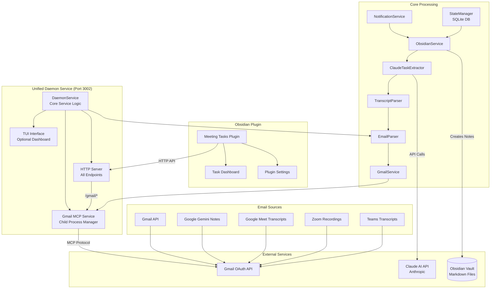

# System Architecture

## Overview

The Meeting Transcript Agent is an automated system that monitors Gmail for meeting transcripts, extracts actionable tasks using AI, and creates organized notes in your Obsidian vault. The system runs as a unified daemon service with integrated Gmail MCP, providing both scheduled processing and manual triggers through an HTTP API, with optional Terminal User Interface (TUI) for real-time monitoring.

## Unified Daemon Architecture



## Component Details

### 1. Unified Daemon Service (NEW)
**Location**: `src/daemon.ts`, `src/daemon/`
- **Single Service Architecture**: One process manages everything
- **Integrated Gmail MCP**: Child process lifecycle management
- **HTTP API**: All endpoints on port 3002
- **Endpoints**:
  - `/health` - Service health check
  - `/status` - Detailed statistics
  - `/trigger` - Manual email processing
  - `/gmail/health` - Gmail MCP health
  - `/gmail/search` - Search emails
  - `/gmail/read` - Read email by ID
- **TUI Mode**: Optional terminal dashboard
- **Headless Mode**: For server deployments

### 2. Gmail MCP Integration
**Location**: `src/daemon/gmailMcpService.ts`
- **Child Process Management**: Spawns and monitors Gmail MCP
- **Automatic Restart**: Exponential backoff on crashes
- **Request/Response Queue**: Handles MCP protocol communication
- **Error Recovery**: Authentication guidance and retry logic
- **Configuration**:
  ```typescript
  {
    restartAttempts: 3,
    startupTimeout: 10000,
    requestTimeout: 30000
  }
  ```

### 3. Email Processing Pipeline
**Components**:
1. **GmailService** (`src/services/gmailService.ts`)
   - Connects to daemon's Gmail MCP endpoint
   - Searches and retrieves emails
   
2. **EmailParser** (`src/parsers/emailParser.ts`)
   - Identifies meeting transcripts
   - Pattern matching for various formats
   
3. **TranscriptParser** (`src/parsers/transcriptParser.ts`)
   - Extracts text from attachments
   - Supports: PDF, DOCX, TXT, HTML, VTT, SRT
   
4. **ClaudeTaskExtractor** (`src/extractors/claudeTaskExtractor.ts`)
   - AI-powered task extraction
   - Structured JSON output
   - Fallback pattern matching

5. **ObsidianService** (`src/services/obsidianService.ts`)
   - Creates formatted meeting notes
   - Links to daily notes
   - Maintains folder structure

### 4. State Management
**Location**: `src/database/stateManager.ts`
- **SQLite Database**: `data/state.db`
- **Processed Emails Tracking**: Prevents duplicates
- **Task Deduplication**: Similarity checking
- **Statistics**: Processing history and metrics

### 5. Obsidian Plugin Integration
**Location**: `obsidian-plugin/`
- **Connection**: Uses daemon's HTTP API
- **Endpoints**: `http://localhost:3002/gmail/*`
- **Features**:
  - Visual task dashboard
  - Manual processing triggers
  - Settings management
  - Real-time status updates

## Data Flow

### Email Processing Flow


### Daemon Lifecycle


## Deployment Options

### 1. Development Mode
```bash
npm run dev         # With auto-reload
npm run daemon      # With TUI dashboard
```

### 2. Production Mode
```bash
npm run daemon:headless  # No UI, quiet mode
```

### 3. Systemd Service (Linux)
```bash
sudo npm run daemon:install
sudo systemctl start meeting-transcript-agent
```

### 4. Docker Container
```dockerfile
FROM node:20
WORKDIR /app
COPY . .
RUN npm install && npm run build
CMD ["npm", "run", "daemon:headless"]
```

## Configuration

### Environment Variables
```env
# Required
OBSIDIAN_VAULT_PATH=/path/to/vault

# Recommended
ANTHROPIC_API_KEY=sk-ant-api03-xxx

# Gmail MCP (Auto-configured)
GMAIL_MCP_RESTART_ATTEMPTS=3
GMAIL_MCP_STARTUP_TIMEOUT=10000
GMAIL_MCP_REQUEST_TIMEOUT=30000

# Optional
GMAIL_HOURS_LOOKBACK=120
NOTIFICATION_CHANNELS=console,desktop
TZ=America/New_York
```

### Gmail OAuth Setup
1. Create Google Cloud project
2. Enable Gmail API
3. Create OAuth 2.0 credentials (Desktop type)
4. Save as `~/.gmail-mcp/gcp-oauth.keys.json`
5. Run initial authentication:
   ```bash
   npx @gongrzhe/server-gmail-autoauth-mcp
   ```

## Performance Characteristics

### Resource Usage
- **Memory**: ~150-250MB typical
- **CPU**: <5% idle, 10-20% processing
- **Disk**: SQLite DB grows ~1MB/1000 emails
- **Network**: Minimal (Gmail API + Claude API)

### Processing Limits
- **Email Search**: 250 units/sec (Gmail API)
- **Task Extraction**: 2-5 sec/transcript
- **Batch Size**: 50 emails/run default
- **Transcript Size**: 15,000 chars max

### Scalability
- **Emails**: Tested with 10,000+ emails
- **Tasks**: 100,000+ tasks in database
- **Concurrent Requests**: Single-threaded by design
- **Multi-user**: Requires separate instances

## Security Considerations

### Authentication & Tokens
- **Gmail OAuth**: Stored in `~/.gmail-mcp/`
- **API Keys**: Environment variables only
- **Refresh Tokens**: Auto-renewed by Gmail MCP

### Data Privacy
- **Local Processing**: No cloud storage
- **Transcript Handling**: Memory only, not persisted
- **Task Storage**: Local SQLite database
- **Network**: Localhost only for services

### Access Control
- **HTTP API**: Localhost binding only
- **File Permissions**: User-level access
- **Obsidian Vault**: Standard file system permissions

## Monitoring & Debugging

### Health Checks
```bash
# Overall health
curl http://localhost:3002/health

# Gmail MCP status
curl http://localhost:3002/gmail/health

# Detailed statistics
curl http://localhost:3002/status
```

### Log Files
- **Application**: `logs/app.log`
- **Daemon**: `daemon.log` (if redirected)
- **Debug Mode**: Set `LOG_LEVEL=debug`

### Common Issues
1. **Gmail Auth Failed**: Re-run OAuth flow
2. **Port in Use**: Check for orphaned processes
3. **High Memory**: Restart daemon periodically
4. **Slow Processing**: Check Claude API limits

## Migration from Old Architecture

### Before (Multiple Services)
- Gmail MCP HTTP wrapper on port 3001
- Separate daemon on port 3002
- Manual service management

### After (Unified Daemon)
- Single service on port 3002
- Integrated Gmail MCP management
- Automatic lifecycle handling
- Simplified deployment

### Migration Steps
1. Stop old services
2. Update Obsidian plugin settings
3. Start unified daemon
4. Verify health endpoints

## Future Enhancements

### Planned Features
- [ ] WebSocket support for real-time updates
- [ ] Multiple Gmail account support
- [ ] Plugin system for additional MCPs
- [ ] Distributed processing
- [ ] Web-based dashboard
- [ ] Mobile app integration

### Architecture Improvements
- [ ] Message queue for reliability
- [ ] Caching layer for performance
- [ ] Metrics collection (Prometheus)
- [ ] Container orchestration (K8s)

## Related Documentation

- [README.md](../README.md) - Getting started guide
- [CLAUDE.md](../CLAUDE.md) - AI assistant context
- [Daemon Service Guide](daemon-service.md) - TUI and service details
- [API Reference](api-reference.md) - Complete endpoint documentation
- [Gmail Setup Guide](GMAIL_SETUP.md) - OAuth configuration
- [Unified Daemon Architecture](ARCHITECTURE_UNIFIED_DAEMON.md) - Integration details