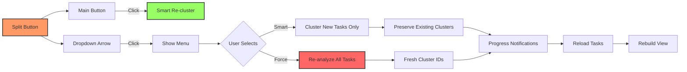

# System Architecture - TaskAgent Plugin

## Overview

The TaskAgent Plugin is a standalone Obsidian solution that integrates directly with Gmail API and Claude AI to automatically extract and manage tasks from emails. The plugin features a **dynamic, configurable label processor architecture** that allows unlimited email types through simple configuration.

## Architecture Diagram


## Component Architecture

### Core Components

#### 1. Main Plugin (main.ts)
- **Purpose**: Entry point and orchestrator
- **Responsibilities**:
  - Plugin lifecycle management
  - Command registration
  - Settings management
  - Event handling (file delete/rename)
  - Service initialization
  - Processor configuration

#### 2. Gmail Service (gmailService.ts)
- **Purpose**: Direct Gmail API integration
- **Features**:
  - OAuth 2.0 authentication flow
  - Token refresh management
  - **Label-based email search** (searches each label separately)
  - Email retrieval with full content
  - Attachment metadata extraction
  - Gmail URL generation for direct email access
  - Batch processing support (3-5 emails in parallel)
  - Automatic pagination (handles 50-500+ emails)
  - Rate limiting protection

#### 3. Processor Registry (ProcessorRegistry.ts)
- **Purpose**: Dynamic email routing system
- **Features**:
  - Initializes processors from settings configuration
  - Routes emails to appropriate processor based on labels
  - Supports unlimited custom processors
  - Falls back to default processor when needed

#### 4. Label Processor (LabelProcessor.ts)
- **Purpose**: Configurable email processing engine
- **Features**:
  - **Dynamic configuration** per Gmail label
  - Custom folder names per label
  - **Prompt type selection** (meeting, actionitem, custom)
  - Automatic folder creation (BaseFolder/LabelFolder/YYYY/MM/)
  - Note formatting with frontmatter
  - Email ID caching for deduplication

#### 5. Claude Extractor (claudeExtractor.ts)
- **Purpose**: AI-powered task extraction
- **Capabilities**:
  - **Meeting transcript analysis** with participant detection
  - **Action item extraction** from regular emails
  - Task identification and prioritization
  - Assignee detection from participants
  - Next steps extraction with owner assignment
  - Google Meet AI suggestions capture
  - Task/Next step deduplication
  - Confidence scoring
  - Fallback extraction mode

#### 6. Task Clusterer (taskClusterer.ts)
- **Purpose**: AI-powered task clustering and similarity detection
- **Capabilities**:
  - **Intelligent grouping** of similar/related tasks
  - **Source email context** - reads email content for better clustering accuracy
  - **Duplicate detection** and consolidation suggestions
  - **Project-based clustering** for related work items
  - **Combination recommendations** with confidence scoring
  - **Automatic clustering** during email import
  - **Parallel processing** alongside extraction
  - **Persistent storage** via cluster IDs in task lines
  - **Smart vs Force modes** - incremental or complete re-clustering
  - **Progress notifications** - detailed status updates during clustering

#### 7. Task Dashboard (taskDashboard.ts)
- **Purpose**: Visual task management interface
- **Features**:
  - **Cluster view** with expandable groups
  - **Editable cluster titles** - customize cluster names with persistent storage
  - **Auto-restore** clustering from saved IDs
  - **Instant toggle** between task list and clustered view (no API calls)
  - **Smart re-cluster dropdown** - choose between smart (preserves clusters) or force (full re-analysis) modes
  - **Multi-filter support** - select multiple filters simultaneously (OR logic)
  - **Simplified filters**: High, Medium, Past Due, This Week, Delegated, Done
  - **Filter persistence** - active filters maintained when switching views
  - Priority-based task organization
  - Interactive task completion
  - Real-time statistics
  - **My Tasks only** - always shows only assigned tasks (except delegated view)
  - Next steps visualization with assignees
  - Combined task suggestions from Claude
  - Task cards grouped by assignee in both views

#### 8. OAuth Server (oauthServer.ts)
- **Purpose**: Local OAuth callback handler
- **Functions**:
  - Temporary HTTP server for OAuth flow
  - Authorization code capture
  - Token exchange handling

## Label Processor Architecture


## Data Flow


## Configuration Model


### Configuration Example

```typescript
interface MeetingTasksSettings {
  gmailLabels: string;              // "transcript, action, custom"
  emailNotesFolder: string;         // "TaskAgent"
  labelProcessors: LabelProcessorConfig[];
}

interface LabelProcessorConfig {
  label: string;                    // Gmail label name
  folderName: string;               // Subfolder name
  promptType?: 'meeting' | 'actionitem' | 'custom';
  customPrompt?: string;            // Future: custom extraction prompt
}

// Example configuration:
{
  gmailLabels: "transcript, action",
  emailNotesFolder: "TaskAgent",
  labelProcessors: [
    {
      label: "transcript",
      folderName: "Transcript",
      promptType: "meeting"
    },
    {
      label: "action",
      folderName: "Action",
      promptType: "actionitem"
    }
  ]
}
```

## File Organization


## Task Format Structure

```typescript
interface TaskStructure {
  content: string;           // Task description
  assignee?: string;         // [[@Person]]
  priority: 'high' | 'medium' | 'low';
  dueDate?: string;         // YYYY-MM-DD format (📅 2025-01-20)
  confidence?: number;       // 0-100 percentage (⚠️ 85%)
  category?: string;        // #tag format
  context?: string;         // Additional information
  originalQuote?: string;   // From email/transcript
  clusterId?: string;       // Cluster assignment (🧩 cluster:abc123)
}
```

### Task Line Example

```markdown
- [ ] Review API documentation [[@John]] 📅 2025-01-20 🔴 🧩 cluster:cluster-1736789012-abc123 #engineering
```

**Metadata Markers:**
- `[[@John]]` - Assignee
- `📅 2025-01-20` - Due date
- `🔴` - High priority (🟡 medium, 🟢 low)
- `🧩 cluster:abc123` - Cluster ID (persisted)
- `#engineering` - Category tag

## Performance Characteristics

- **Email Processing**: Up to 500 emails per run with pagination
- **Pagination**: Automatic handling of Gmail API pages (50-100 per page)
- **Parallel Batching**: 3-5 emails processed simultaneously
- **Smart Sorting**: Newest emails processed first for relevance
- **Content Limit**: 15,000 characters per email
- **Cache Strategy**: Vault-based deduplication (scales infinitely)
- **Memory Usage**: ~50MB typical footprint
- **Build Size**: ~74KB minified bundle

## Security Model


## Deployment Architecture


## Scalability Features

### Email ID Caching
- **Primary**: Scans vault frontmatter on startup
- **Backup**: Stores email IDs in data.json for faster cold starts
- **Scalable**: Can handle unlimited emails (cached from vault)
- **Auto-cleanup**: Can clear data.json array anytime without data loss

### Performance at Scale
- **1,000 emails**: ~5KB cache, instant processing
- **10,000 emails**: ~16KB cache, <1s vault scan
- **100,000+ emails**: ~160KB cache, <5s vault scan
- **No sharding needed**: Vault scan architecture handles scale

## Error Handling Strategy

1. **OAuth Errors**: Token refresh with exponential backoff
2. **API Rate Limits**: Built-in rate limiting and retry logic
3. **Network Failures**: Graceful degradation with user notifications
4. **Parsing Errors**: Fallback extraction mode
5. **Cache Conflicts**: Automatic resolution with deduplication
6. **Reprocessing Safety**: Preserves file paths and handles conflicts
7. **Missing Processors**: Skips emails without configured processor

## Extensibility

### Adding New Email Types

1. **Configure in Settings**:
```json
{
  "gmailLabels": "transcript, action, newsletter",
  "labelProcessors": [
    {
      "label": "newsletter",
      "folderName": "Newsletter",
      "promptType": "actionitem"
    }
  ]
}
```

2. **Plugin automatically**:
   - Creates processor for the label
   - Routes matching emails
   - Creates organized folder structure
   - Uses appropriate Claude prompt

### Future Custom Prompts

The architecture supports custom extraction prompts (planned feature):

```typescript
{
  label: "research",
  folderName: "Research",
  promptType: "custom",
  customPrompt: "Extract research topics and questions from this email..."
}
```

## Task Clustering Architecture

### Clustering Flow

```mermaid
graph LR
    A[Email Import] --> B[Extract Tasks]
    B --> C[Batch Complete]
    C --> D[Trigger Clustering]

    D --> E[Load All Tasks]
    E --> F[Filter Incomplete]

    F --> G{Enough Tasks?}
    G -->|< 2 tasks| H[Skip]
    G -->|≥ 2 tasks| I[Send to Claude]

    I --> J[Analyze Similarities]
    J --> K[Group Related Tasks]
    K --> L[Generate Clusters]

    L --> M[Save Cluster IDs]
    M --> N[Update Task Lines]
    N --> O[🧩 cluster:xyz added]

    O --> P[Dashboard Auto-Restores]

    style D fill:#9f6,stroke:#333,stroke-width:2px
    style I fill:#bbf,stroke:#333,stroke-width:2px
    style M fill:#6f9,stroke:#333,stroke-width:2px
```



### Cluster Persistence Model

```mermaid
graph TB
    subgraph "Task Storage in Markdown"
        A[Task Line] --> B[Core Content]
        A --> C[Metadata]

        C --> D[Assignee: [[@Name]]]
        C --> E[Due Date: 📅 YYYY-MM-DD]
        C --> F[Priority: 🔴🟡🟢]
        C --> G[Cluster: 🧩 cluster:id]
        C --> H[Category: #tag]
    end

    subgraph "Cluster Loading"
        I[Dashboard Loads] --> J[Read All Tasks]
        J --> K[Extract Cluster IDs]
        K --> L{Clusters Found?}

        L -->|Yes| M[Group by Cluster ID]
        L -->|No| N[Show Normal View]

        M --> O[Build Cluster Objects]
        O --> P[Display Clustered View]
    end

    G -.-> K

    style G fill:#9f6,stroke:#333,stroke-width:2px
    style M fill:#6f9,stroke:#333,stroke-width:2px
```

### Clustering Features

1. **Automatic Clustering**: Runs in parallel after each email batch import
2. **Persistent Storage**: Cluster IDs saved directly in markdown task lines
3. **Auto-Restore**: Dashboard automatically rebuilds clusters from saved IDs (but shows normal view by default)
4. **Instant Toggle**: Switch between clustered and normal view without API calls
5. **Smart Grouping**: Claude analyzes task descriptions, categories, assignees, priorities, and **source email context**
6. **Duplicate Detection**: Identifies similar or duplicate tasks
7. **Combination Suggestions**: Recommends merging related tasks with confidence scores
8. **Filter Integration**: All filters (priority, date, etc.) work in clustered view
9. **Multi-Filter Support**: Apply multiple filters simultaneously with OR logic
10. **JSON Auto-Repair**: Automatically fixes truncated Claude responses (missing braces/brackets)
11. **Editable Titles**: Customize cluster titles with persistent storage in `.obsidian/plugins/meeting-tasks/cluster-titles.json`
12. **Smart vs Force Re-clustering**:
    - **Smart**: Only clusters new tasks without cluster IDs (preserves existing clusters)
    - **Force**: Re-analyzes ALL tasks from scratch (creates fresh clusters)
13. **Progress Notifications**: Real-time status updates during clustering process
14. **Source Context Analysis**: Reads email/meeting content (first 500 chars) to improve clustering accuracy

## Dashboard UI Components

### Re-Cluster Button Architecture



### Cluster Title Editing Flow

```mermaid
sequenceDiagram
    participant User
    participant Dashboard
    participant Modal
    participant Storage
    participant Vault

    User->>Dashboard: Click ✏️ edit button
    Dashboard->>Modal: Open ClusterTitleModal
    Modal->>User: Show input with current title

    User->>Modal: Edit title
    User->>Modal: Click Save

    Modal->>Dashboard: Return new title
    Dashboard->>Storage: Save to cluster-titles.json
    Dashboard->>Dashboard: Update in-memory cluster
    Dashboard->>User: Update UI immediately

    Note over Storage: Persisted separately from vault
    Note over Vault: Cluster IDs remain in task lines

    Dashboard->>User: Show success notice
```



### Data Storage Architecture

```mermaid
graph TB
    subgraph "Task Data (In Vault)"
        A[Markdown Files] --> B[Task Lines]
        B --> C[Cluster IDs: 🧩 cluster:xyz]
    end

    subgraph "Cluster Metadata (Plugin Storage)"
        D[cluster-titles.json] --> E[Custom Titles]
        E --> F[clusterId → title mapping]
    end

    subgraph "Dashboard Runtime"
        G[Load Tasks] --> H[Extract Cluster IDs]
        I[Load Custom Titles] --> J[Apply to Clusters]

        H --> K[Group Tasks by ID]
        J --> K
        K --> L[Build Cluster Objects]
        L --> M[Display to User]
    end

    C -.-> H
    F -.-> I

    style C fill:#9f6,stroke:#333,stroke-width:2px
    style F fill:#6f9,stroke:#333,stroke-width:2px
    style L fill:#bbf,stroke:#333,stroke-width:2px
```



## Future Architecture Considerations

- **WebSocket Support**: For real-time email monitoring
- **Custom Prompt UI**: For defining extraction templates
- **Custom Clustering Prompts**: User-defined clustering logic
- **Cluster Templates**: Save and reuse clustering configurations
- **Sync Service**: For multi-device task synchronization
- **Template Engine**: For customizable note formats
- **Analytics Dashboard**: For productivity insights with cluster insights
- **Bulk Operations**: For batch task management across clusters
- **Cluster Sharing**: Export/import cluster configurations between vaults
