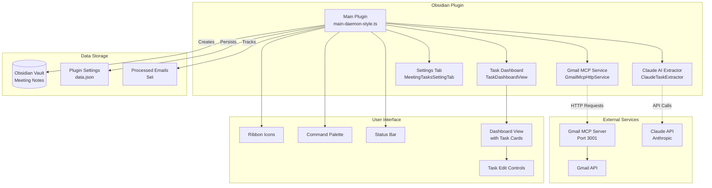
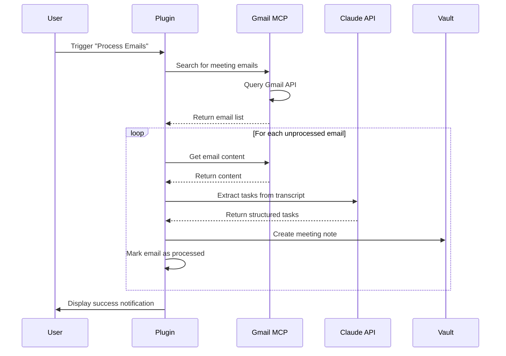

# System Architecture - Obsidian Meeting Tasks Plugin

## Overview

The Obsidian Meeting Tasks Plugin is a comprehensive solution for automatically extracting and managing tasks from meeting transcripts. It integrates with Gmail (via MCP), uses Claude AI for intelligent task extraction, and provides a visual dashboard for task management.

## Architecture Diagram



## Component Details

### Core Components

#### 1. Main Plugin (`main-daemon-style.ts`)
- **Purpose**: Central orchestrator for all plugin functionality
- **Responsibilities**:
  - Initializes services on plugin load
  - Manages plugin lifecycle
  - Coordinates email processing workflow
  - Handles settings persistence
  - Registers UI components

#### 2. Gmail MCP Service (`GmailMcpHttpService`)
- **Purpose**: Bridge between Obsidian and Gmail via MCP server
- **Key Methods**:
  - `connect()`: Establishes connection to MCP server
  - `searchEmails()`: Searches for emails using Gmail query syntax
  - `getEmailContent()`: Retrieves full email content
  - `fetchRecentMeetingEmails()`: Finds meeting-related emails
- **Communication**: HTTP requests to localhost:3001

#### 3. Claude Task Extractor (`ClaudeTaskExtractor`)
- **Purpose**: Intelligent task extraction using Claude AI
- **Features**:
  - Extracts tasks with assignees, priorities, and due dates
  - Identifies meeting participants
  - Captures key decisions and next steps
  - Provides confidence scores
- **Models Supported**:
  - Claude 3.5 Haiku (Fast & economical)
  - Claude Sonnet 4 (Balanced)
  - Claude Opus 4.1 (Most capable)

#### 4. Task Dashboard (`TaskDashboardView`)
- **Purpose**: Visual task management interface
- **Features**:
  - Priority-based task grouping (High/Medium/Low)
  - Assignee-based card organization
  - Interactive task completion
  - Advanced filtering (Today, This Week, My Tasks)
  - Statistics overview
  - In-line task editing with priority/assignee changes
  - Toggle between My Tasks and All Tasks views
- **UI Improvements**:
  - Edit button positioned in top-left of each task item
  - Proper flexbox layout for maintainable structure
  - Theme-aware styling with CSS variables
  - High contrast metadata tags for better readability
- **Customization**:
  - Configurable personal task filtering
  - User-specific name prioritization
  - Support for Obsidian's built-in priority syntax (⏫ ⏬ 🔼 🔽)

### External Dependencies

#### Gmail MCP Server
- **Location**: `http://localhost:3001`
- **Purpose**: Provides OAuth-authenticated Gmail access
- **Protocol**: MCP (Model Context Protocol)
- **Wrapper**: HTTP bridge for Obsidian compatibility

#### Claude API
- **Endpoint**: `https://api.anthropic.com/v1/messages`
- **Authentication**: API key-based
- **Usage**: Task extraction from meeting transcripts

### Data Flow



## Configuration

### Settings Structure

```typescript
interface MeetingTasksSettings {
  // Email Processing
  lookbackHours: number;           // How far back to search (default: 120)
  
  // Services
  mcpServerUrl: string;            // Gmail MCP server URL
  anthropicApiKey: string;         // Claude API key
  claudeModel: string;             // Selected Claude model
  
  // Organization
  notesFolder: string;             // Where to store notes (default: "Meetings")
  
  // Dashboard
  dashboardShowOnlyMyTasks: boolean;  // Filter to personal tasks
  dashboardMyName: string;            // User's name for filtering
  
  // Internal
  debugMode: boolean;              // Enable debug logging
}
```

### Meeting Note Format

```markdown
---
title: Meeting Title
date: YYYY-MM-DD
type: meeting
source: Gmail
emailId: unique-id
participants: ["Name1", "Name2"]
confidence: 85
tags: [meeting, has-tasks]
---

## Summary
Brief meeting summary

## Key Decisions
- Decision 1
- Decision 2

## Action Items

### 🔴 High Priority
- [ ] Task description [[@Assignee]] 📅 YYYY-MM-DD

### 🟡 Medium Priority
- [ ] Task description [[@Assignee]] 📅 YYYY-MM-DD

## Next Steps
- Next step 1
- Next step 2
```

## Installation & Setup

### Prerequisites

1. **Gmail MCP Server**
   ```bash
   npm install -g @gongrzhe/server-gmail-autoauth-mcp
   npm run gmail-mcp-http  # Start HTTP wrapper on port 3001
   ```

2. **Claude API Key**
   - Obtain from [Anthropic Console](https://console.anthropic.com/)
   - Configure in plugin settings

3. **Obsidian Configuration**
   - Enable the plugin in Community Plugins
   - Configure settings (API keys, folders, etc.)

### File Structure

```
.obsidian/plugins/meeting-tasks/
├── main.js                 # Compiled plugin
├── manifest.json           # Plugin metadata
├── styles.css             # Plugin styles
├── styles/
│   └── dashboard.css      # Dashboard-specific styles
└── data.json              # Plugin settings & state
```

## Security Considerations

1. **API Keys**: Stored locally in vault's `.obsidian` folder
2. **OAuth Tokens**: Managed by Gmail MCP server in `~/.gmail-mcp/`
3. **Data Privacy**: All processing happens locally
4. **Network Security**: MCP server runs on localhost only

## Performance Optimization

- **Email Deduplication**: Tracks processed emails to avoid reprocessing
- **Batch Processing**: Processes up to 50 emails per run
- **Caching**: Settings and processed emails cached locally
- **Lazy Loading**: Dashboard loads tasks on demand
- **Truncation**: Limits transcript size sent to Claude (15,000 chars)

## Error Handling

- **Connection Failures**: Automatic reconnection attempts
- **API Errors**: Fallback to basic extraction
- **Rate Limiting**: Respects Claude API limits
- **Invalid Content**: Graceful handling of malformed emails

## Future Enhancements

- [ ] Support for additional meeting platforms
- [ ] Real-time email monitoring
- [ ] Bulk task operations
- [ ] Task synchronization with external systems
- [ ] Advanced analytics dashboard
- [ ] Template customization